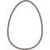
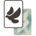

# Contributing to supporting other languages

If you own the game in other language which is not fully translated (or you have found a typo) and want to contribute, I'd really appreciate that. To make the whole process the easiest, please follow the next steps.

* If the language is already partially translated, simply download the corresponding file from above. If not, copy the file [`template.xlsx`](template.xlsx) and name it according to respective [ISO 639-1 2-letter language code](https://en.wikipedia.org/wiki/List_of_ISO_639-1_codes) (e.g. for german it would be `de.xlsx`) and save it in this folder.

* Fill the necessary information in the file. Do not change any predefined cells. The file consists of 3 sheets. 

* **Pay attention to the following format.** Specify icons in card descriptions using their name inside of square brackets.

E.g. for American Bittern (*Botaurus lentiginosus*), the power text in english looks like this: `Player(s) with the fewest [wetland] birds: draw 1 [card].`

Below you find the table of all needed icons and their codes.

| Icon | Code |
| ----------- | ----------- |
|  | [automa] |
|  | [bird] |
|  | [bowl] |
|  | [card] |
|  | [cavity] |
|  | [die] |
|  | [egg] |
|  | [fish] |
|  | [flocking] |
|  | [forest] |
|  | [fruit] |
|  | [grassland] |
|  | [ground] |
|  | [invertebrate] |
|  | [platform] |
|  | [point] |
|  | [predator] |
|  | [rodent] |
|  | [seed] |
|  | [star] |
|  | [wetland] |
|  | [wild] |

## Excel sheets

### Birds sheet
| Field | Description |
| ----------- | ----------- |
| id | Internal identificator of the bird, do not change this value |
| English name| The common name of a bird in english. It helps you to identify, which bird should be in that row  |
| Scientific name| The name of a bird in latin. It helps you to identify, which bird should be in that row  |
| Name| Fill there the common name of a bird in a desired language |
| Power text| Fill there the ability of the bird. Leave empty if the bird has no ability |
| Note| Fill there additional information about a bird from the appendix. Leave empty if the bird has no additional info |

**Language dependent bonus cards - applicable birds for these bonus cards may differ in your language. There are predefined values for english, please change those columns according to the rules of your language.**

| Field | Description |
| ----------- | ----------- |
| Anatomist| Type **X** if the bird is eligible for this bonus card. Leave empty otherwise|
| Cartographer| Type **X** if the bird is eligible for this bonus card. Leave empty otherwise|
| Historian| Type **X** if the bird is eligible for this bonus card. Leave empty otherwise|
| Photographer| Type **X** if the bird is eligible for this bonus card. Leave empty otherwise|

### Bonuses
| Field | Description |
| ----------- | ----------- |
| id | Internal identificator of the bird, do not change this value |
| English name| The name of a bonus card in english. It helps you to identify, which bonus card should be in that row  |
| Name| Fill there the title of a bonus card in a desired language |
| Condition| Main description of a bonus card following the title|
| Explanatory text| Additional explanation of bonus card condition, typically found at the bottom of the card |
| VP| Victory points scoring system. Multiple scoring systems are separated by `;`. Please, follow the format from this examples: Anatomist - `2 to 3 birds: 3[point]; 4+ birds: 7[point]`, Behaviorist - `3[point] per column` |
| Note| Additional information from the appendix |

### Other
| Field | Description |
| ----------- | ----------- |
| WHEN ACTIVATED| Add local translation of respected brown power text |
| WHEN PLAYED| Add local translation of respected white power text  |
| ONCE BETWEEN TURNS| Add local translation of respected pink power text |
| ROUND END| Add local translation of respected teal power text (European expansion)|
| GAME END| Add local translation of respected yellow power text (Oceania expansion)|
| of cards| `% of cards` is the text found at the bottom of bonus cards describing how many percent of bird cards fulfill the condition |

In the case of any further uncertainties, take a look at the format used in [this spreadsheet](../scripts/wingspan-card-list.xlsx) or open a github issue.

## Submitting your file
If you know how to work with git, just open the pull request. If not, you can email me the file at matej.cief@gmail.com
